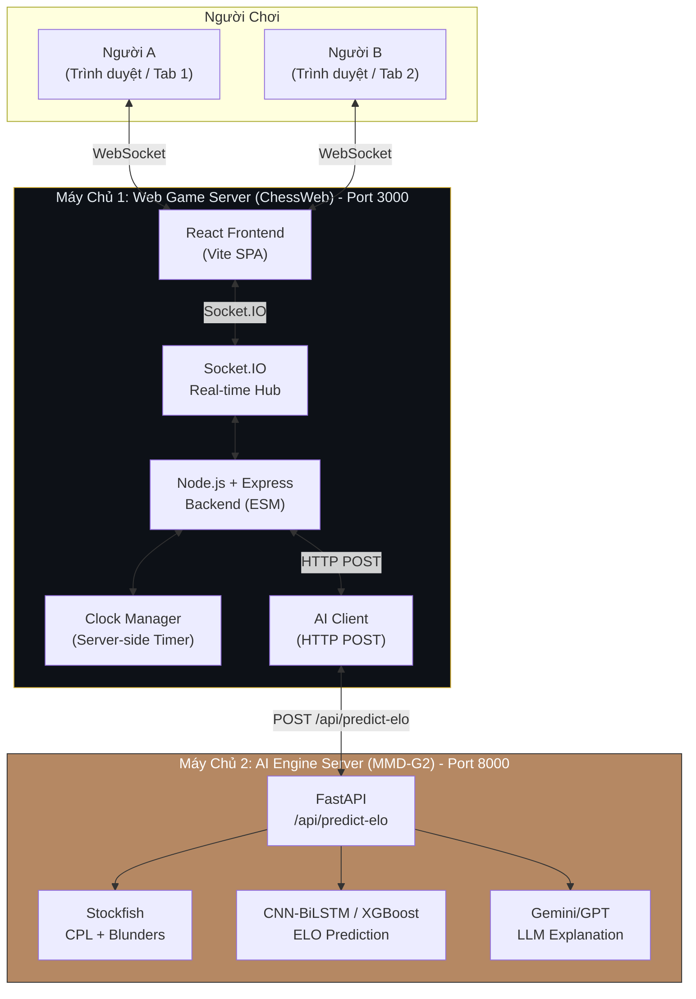

# Design: ChessWeb PoC — System Architecture

## Architecture Overview

### High-Level System Structure



### Components và Trách nhiệm

| Component | Trách nhiệm | File |
|-----------|-------------|------|
| `React Frontend` | SPA router, Lobby, GameBoard, Clock UI, ResultModal, MoveHistory | `src/` |
| `Socket.IO Client` | Kết nối WebSocket, emit/receive events, auto-reconnect | `src/socket.js` |
| `Node.js Backend` | HTTP server, serve Vite dev/build, route logic, Socket.IO hub | `server/index.js` |
| `Room Manager` | Tạo/xóa phòng, gán màu quân, track players, handle disconnect/reconnect | `server/roomManager.js` |
| `Game Logic` | Validate move, detect game over, build PGN | `server/gameLogic.js` |
| `Clock Manager` | Server-side timer: start/stop/switch, record timeSpent | `server/clockManager.js` |
| `AI Client` | Gọi HTTP POST sang AI Engine, handle timeout/fallback | `server/aiClient.js` |

### Technology Stack

| Layer | Công nghệ | Phiên bản | Ghi chú |
|-------|-----------|-----------|---------|
| **Frontend Framework** | React | 19.x | Đã scaffold với Vite |
| **Build Tool** | Vite | 6.x | Dev server + production build |
| **Chess Board** | react-chessboard | 5.x | `onPromotion` callback cho auto-Queen |
| **Chess Logic** | chess.js | 1.4.x | Validate moves, FEN, checkmate/stalemate detection |
| **Real-time** | Socket.IO | Client + Server | WebSocket 2 chiều |
| **Routing** | react-router-dom | v7 | SPA navigation `/` và `/room/:roomId` |
| **Backend** | Node.js + Express | Latest | ESM modules |
| **HTTP Client** | native `fetch` | Built-in | Gọi AI Engine API (Node 18+) |
| **Styling** | Custom CSS | - | CSS variables, dark theme |

---

## Data Models

### 1. Room Entity (Server-side — `server/roomManager.js`)

```javascript
// rooms: Map<roomId, Room>
export const rooms = new Map();

/**
 * @typedef {Object} Room
 * @property {string} id                  - Mã phòng (nanoid 8 ký tự)
 * @property {'waiting'|'playing'|'finished'} status
 * @property {{ white: string|null, black: string|null }} players
 *                                          - socket.id của từng người chơi
 *                                          - = null khi disconnect, = newSocketId khi reconnect
 * @property {{ white: string|null, black: string|null }} sessionTokens
 *                                          - session token (UUID) để restore sau reconnect
 * @property {string[]} moves             - Mảng SAN notation: ["e4", "e5", "Nf3", ...]
 * @property {number[]} clockTimes        - Mảng thời gian suy nghĩ (giây), xen kẽ Trắng→Đen
 * @property {string} fen                 - FEN string trạng thái hiện tại
 * @property {{ initial: number, increment: number }} timeControl
 *                                          - Ví dụ: { initial: 900, increment: 0 } (15 phút)
 * @property {number} whiteTimeLeft       - Giây còn lại của Trắng
 * @property {number} blackTimeLeft       - Giây còn lại của Đen
 * @property {number|null} lastMoveTimestamp - Date.now() khi nước cuối được đi
 * @property {'w'|'b'} currentTurn       - Lượt đi hiện tại
 * @property {string|null} result         - "1-0" | "0-1" | "1/2-1/2"
 * @property {string|null} resultReason   - "checkmate" | "timeout" | "resign" | "stalemate"
 * @property {number} createdAt           - Timestamp tạo phòng
 * @property {number|null} finishedAt     - Timestamp game over
 */

/**
 * Disconnect tracking
 * @typedef {Object} DisconnectSession
 * @property {string} roomId
 * @property {string} color               - "white" | "black"
 * @property {string} sessionToken        - Token để restore
 * @property {number} disconnectedAt
 */
export const disconnectedSessions = new Map(); // key = sessionToken, value = DisconnectSession

/** @type {Map<string, number>} roomId → setTimeoutId */
export const roomCleanupTimers = new Map();
```

### 2. Clock State (Server-side — `server/clockManager.js`)

```javascript
/**
 * @typedef {Object} ClockState
 * @property {number} whiteTimeLeft
 * @property {number} blackTimeLeft
 * @property {'white'|'black'|null} activeSide
 * @property {number|null} intervalId     - setInterval ID (để clear)
 * @property {number|null} lastTick      - Timestamp tick cuối
 * @property {'running'|'paused'|'stopped'} clockStatus
 */

/**
 * @type {Map<string, ClockState>} roomId → ClockState
 */
export const clocks = new Map();
```

### 3. AI Request / Response

```javascript
// POST /api/predict-elo

// Request body
const aiRequest = {
  pgn: "1. e4 e5 2. Nf3 Nc6 3. Bb5 a6 4. Ba4 Nf6",
  clock_times: [5.2, 3.1, 12.0, 8.5, 2.1, 45.3],
  result: "1-0",
  time_control: "15+0",
};

// Success response
const aiResponse = {
  success: true,
  data: {
    white_elo: 1540,
    black_elo: 1200,
    eco: { code: "B50", name: "Sicilian Defense" },
    stats: {
      white_avg_cpl: 25.3,
      black_avg_cpl: 78.1,
      white_blunders: 0,
      black_blunders: 3,
      total_moves: 42,
    },
    explanation: "Trắng khai cuộc Phòng thủ Sicilian biến thể B50...",
  },
};

// Error response
const aiErrorResponse = {
  success: false,
  error: "Stockfish engine not available",
};
```

---

## API Design

### Socket.IO Events

#### a) Kết nối & Phòng chơi

| Event | Direction | Payload | Mô tả |
|-------|-----------|---------|--------|
| `create_room` | Client → Server | `{}` | Yêu cầu tạo phòng mới |
| `room_created` | Server → Client | `{ roomId: string, sessionToken: string }` | Trả mã phòng + session token |
| `join_room` | Client → Server | `{ roomId: string }` | Yêu cầu vào phòng |
| `joined` | Server → Client | `{ color, roomId, fen, sessionToken, whiteTime, blackTime, moves, clockTimes }` | Xác nhận đã vào, gán màu quân |
| `opponent_joined` | Server → Client | `{ fen, whiteTime, blackTime }` | Đối thủ đã vào, bắt đầu ván đấu |
| `room_full` | Server → Client | `{ message: string }` | Từ chối — phòng đã đầy |
| `room_not_found` | Server → Client | `{ message: string }` | Phòng không tồn tại |

#### b) Trong ván đấu

| Event | Direction | Payload | Mô tả |
|-------|-----------|---------|--------|
| `make_move` | Client → Server | `{ move: string, fen: string }` | Người chơi gửi nước đi. `move` = SAN |
| `move_made` | Server → Opponent | `{ move, san, fen, whiteTime, blackTime, activeSide }` | Broadcast nước đi + cập nhật đồng hồ |
| `clock_update` | Server → Both | `{ whiteTime, blackTime, activeSide }` | Sync đồng hồ định kỳ mỗi 1 giây |
| `resign` | Client → Server | `{}` | Người chơi xin thua |
| `exit_room` | Client → Server | `{}` | Người chơi chủ động thoát phòng |
| `opponent_left` | Server → Client | `{}` | Đối thủ đã thoát phòng |
| `invalid_move` | Server → Client | `{ message: string }` | Nước đi không hợp lệ |
| `not_your_turn` | Server → Client | `{ message: string }` | Chưa đến lượt đi |

#### c) Kết thúc ván

| Event | Direction | Payload | Mô tả |
|-------|-----------|---------|--------|
| `game_over` | Server → Both | `{ result: string, reason: string }` | Thông báo ván kết thúc |
| `ai_loading` | Server → Both | `{}` | Báo hiện overlay Loading |
| `ai_result` | Server → Both | `{ white_elo, black_elo, eco, stats, explanation }` | Trả kết quả AI, hiện Result Modal |
| `ai_error` | Server → Both | `{ message: string }` | AI Engine lỗi, hiện fallback |

#### d) Disconnect / Reconnect

| Event | Direction | Payload | Mô tả |
|-------|-----------|---------|--------|
| `opponent_disconnected` | Server → Client | `{}` | Đối thủ mất kết nối, clock bị pause |
| `opponent_reconnected` | Server → Client | `{}` | Đối thủ đã reconnect, clock resume |
| `reconnect` | Client → Server | `{ roomId: string, sessionToken: string }` | Client reconnect, gửi session token |
| `reconnected` | Server → Client | `{ color, roomId, fen, whiteTime, blackTime, moves, clockTimes, activeSide }` | Full game state restore |

#### e) Reset / Play Again

| Event | Direction | Payload | Mô tả |
|-------|-----------|---------|--------|
| `play_again` | Client → Server | `{}` | Yêu cầu chơi lại |
| `reset_game` | Server → Both | `{ fen, whiteTime, blackTime, activeSide }` | Reset bàn cờ + clock |

### REST Endpoints

| Method | Path | Mô tả | Response |
|--------|------|--------|----------|
| GET | `/` | Serve SPA fallback | HTML |
| GET | `/health` | Health check | `{ "status": "ok", "timestamp": "..." }` |

---

## Component Breakdown

### Backend Components

#### `server/index.js` — Entry Point

- Setup Express + Socket.IO (port **3000**)
- Serve Vite dev server proxy / production static build
- Mount REST routes (`/health`)
- Socket.IO connection handler
- Import và delegate đến `roomManager`, `gameLogic`, `clockManager`, `aiClient`
- Handle `disconnect`: giữ room state, KHÔNG xóa phòng

#### `server/roomManager.js` — Quản lý Phòng

```javascript
// API surface:
createRoom() → { roomId, sessionToken }
getRoom(roomId) → Room | null
joinRoom(roomId, socket) → { success, color, sessionToken, error }
exitRoom(roomId, color) → { action: 'waiting'|'playing'|'finished' }
//   - Nếu status === 'waiting': xóa phòng
//   - Nếu status === 'playing': opponent thắng do resign
handleDisconnect(roomId, color) → void
//   - Set players[color] = null
//   - Nếu cả 2 đều null: đặt cleanup timer 30 giây
//   - Nếu 1 bên còn: pause clock của bên out
cancelCleanupTimer(roomId) → void
restoreSession(sessionToken, newSocketId) → { success, roomState, color } | null
getPlayerColor(roomId, socketId) → "white" | "black" | null
getRoomStateForReconnect(roomId, color) → { fen, moves, clockTimes, whiteTime, blackTime, activeSide }
cleanupRoom(roomId) → void
scheduleRoomCleanup(roomId, delayMs) → void
scheduleFinishedRoomCleanup(roomId) → void  // 5 phút sau game_over
```

#### `server/gameLogic.js` — Logic Cờ

```javascript
// API surface:
validateMove(fen, san) → { valid: boolean, error?: string }
makeMove(room) → { newFen, isCheck, isCheckmate, isStalemate }
detectGameOver(room) → { isOver: boolean, result?: string, reason?: string }
buildPGN(moves[]) → string  // "1. e4 e5 2. Nf3 Nc6 O-O"

// Internals:
- Dùng chess.js để kiểm tra luật
- Parse promotion moves (VD: "e7e8q") — gửi kèm suffix trong SAN
- Hỗ trợ Castling, En passant, Promotion
- Game over CHỈ detect bằng isCheckmate() và isStalemate() + timeout + resign
```

#### `server/clockManager.js` — Server-side Clock

```javascript
// Time control: 15+0 (900 giây, 0 increment)
// API surface:
initClock(roomId, timeControl)  → void   // { initial: 900, increment: 0 }
startClock(roomId)              → void   // Bắt đầu countdown
pauseClock(roomId, side)       → void   // Tạm dừng clock của 1 bên (khi disconnect)
resumeClock(roomId, side)       → void   // Tiếp tục clock của 1 bên (khi reconnect)
pauseAllClock(roomId)          → void   // Tạm dừng cả 2 bên (khi cả 2 disconnect)
switchClock(roomId)             → { timeSpent: number }  // Chuyển bên, record thời gian
getTimes(roomId)                → { whiteTime, blackTime }
getActiveSide(roomId)           → 'white' | 'black' | null
stopClock(roomId)               → void
resetClock(roomId)              → void   // Reset về initial

// Internals:
- setInterval 1 giây → decrement activeSide time (CHỈ khi clockStatus === 'running')
- Khi về 0 → callback 'timeout' → trigger game_over
- Clock PAUSE khi player disconnect (chỉ pause phía disconnect, bên kia vẫn chạy)
- Clock RESUME khi player reconnect
```

#### `server/aiClient.js` — Gọi AI Engine

```javascript
// API surface:
async requestELOPrediction(room) → Promise<AIResult | null>

// Implementation:
// 1. buildPGN(room.moves)
// 2. HTTP POST http://AI_ENGINE_URL/api/predict-elo
//    body: { pgn, clock_times, result, time_control: "15+0" }
// 3. Timeout 30 giây
// 4. Return parsed JSON hoặc null nếu lỗi
```

### Frontend Components

#### `src/App.jsx` — Router chính

```jsx
// Routing (react-router-dom v7):
// /             → Lobby
// /room/:roomId → GameRoom

// On mount: check localStorage for sessionToken → emit reconnect if found
// Session token key: 'chess_session_token'
```

#### `src/socket.js` — Socket.IO Client Singleton

```javascript
// Singleton pattern — import từ bất kỳ component nào
// Key functions:
// - socket.connect() / socket.disconnect()
// - getSocket() → Socket instance
// - setSessionToken(token) → lưu vào localStorage
// - getSessionToken() → đọc từ localStorage
// - clearSessionToken() → xóa khi thoát phòng
// Socket config: { transports: ['websocket', 'polling'], reconnection: true }
```

#### `src/pages/Lobby.jsx` — Sảnh chờ

- **KHÔNG có username dialog** (xóa hoàn toàn)
- Nút lớn: `[ Tạo Phòng Mới ]`
- Input: nhập mã phòng + nút `[ Vào Phòng ]`
- Sau khi tạo phòng → redirect sang `/room/:roomId`

#### `src/pages/GameRoom.jsx` — Phòng đấu (Container)

- Header: Mã phòng + Màu quân của bạn
- Layout 3 cột: Thông tin Đen + Đồng hồ Đen | Bàn cờ | Đồng hồ Trắng + Thông tin Trắng
- Sidebar: Move History + Nút "Xin Thua" + Nút "Thoát Phòng"
- Handle Socket events: `move_made`, `clock_update`, `game_over`, `ai_result`, `ai_error`, `opponent_disconnected`, `opponent_reconnected`, `opponent_left`, `reset_game`, `reconnected`, `invalid_move`, `not_your_turn`
- Handle AI loading state: hiện/ẩn overlay

#### `src/components/ChessBoard.jsx` — Bàn cờ

- Wrapper quanh `react-chessboard`
- Props: `position` (FEN), `orientation`, `onPieceDrop(source, target)`, `onPromotion`
- Auto-flip board khi là phe Đen
- Kích thước: 480×480px
- **Auto-promote Queen**: `onPromotion={() => 'q'}` — return 'q' tự động lên Hậu
- **Check indicator**: Dùng `chess.inCheck()` để detect. Tính vị trí vua, overlay CSS highlight đỏ

#### `src/components/Clock.jsx` — Đồng hồ (Server-sync)

- Props: `{ whiteTime, blackTime, activeSide, myColor }`
- `activeSide`: `'white' | 'black' | null`
- Format: `MM:SS`
- Running: màu cam/sáng. Paused: màu xám. Stopped: màu đỏ.
- Chỉ hiển thị — không tự đếm ngược (server là nguồn sự thật)

#### `src/components/MoveHistory.jsx` — Lịch sử nước đi (SAN)

- Props: `moves: string[]`
- Format: 2 cột (cột số + cột Trắng + cột Đen)
- Auto-scroll xuống cuối khi có nước mới

#### `src/components/ResultModal.jsx` — Bảng kết quả

- Props: `{ result, reason, aiData, loading, error }`
- Khi `loading=true`: Spinner + "Đang phân tích ELO bằng AI..."
- Khi `aiData` có: Hiện ELO Trắng/Đen, ECO, CPL, Blunders, Explanation
- Khi `error`: Hiện kết quả cơ bản + thông báo fallback
- Nút: `[ Chơi Lại ]`

#### `src/components/WaitingOverlay.jsx` — Chờ đối thủ

- Hiện khi đã vào phòng nhưng đối thủ chưa vào
- Hiển thị link mời để copy + nút Copy Link

#### `src/components/DisconnectedOverlay.jsx` — Đối thủ đã disconnect

- Hiện khi nhận `opponent_disconnected`
- Text: "Đối thủ đã disconnect. Đang chờ reconnect..."

---

## Design Decisions

### Decision 1: React + Vite (thay vì CRA)

- **Chọn:** Vite thay vì Create React App
- **Lý do:** Scaffold từ đầu trong phiên đầu tiên, dùng Vite cho fast HMR
- **Trade-off:** Không ảnh hưởng đến spec — tech stack nào cũng được miễn tuân thủ API contract

### Decision 2: Server-side Clock là nguồn sự thật

- **Chọn:** Server quản lý đồng hồ, client chỉ hiển thị (nhận `clock_update` mỗi 1 giây)
- **Lý do:** Tránh người chơi dùng DevTools hack thời gian
- **Trade-off:** Tăng độ phức tạp, nhưng cần thiết cho PoC Demo đáng tin cậy

### Decision 3: Clock Pause/Resume khi Disconnect

- **Chọn:** Khi 1 player disconnect: clock bên đó PAUSE, bên kia TIẾP TỤC chạy
- **Lý do:** Tránh griefing (player disconnect để "pause" clock). Bên còn lại không bị thiệt.
- **Alternative considered:** Pause tất cả → REJECTED vì cho phép exploit

### Decision 4: Session Token cho Reconnect

- **Chọn:** Mỗi player được gán session token (nanoid) khi vào phòng, lưu vào `localStorage`
- **Lý do:** Socket ID thay đổi sau reconnect, cần cách khác để identify player
- **Flow:**
  1. Join room → Server sinh `sessionToken`, lưu vào `room.sessionTokens[color]`
  2. Client lưu vào `localStorage` key `'chess_session_token'`
  3. Disconnect → Socket mất
  4. Reconnect → Client gửi `sessionToken` lên server
  5. Server lookup → restore game state → gán lại `socketId`

### Decision 5: Room Lifecycle & Cleanup

- **Chọn:** Nhiều tầng cleanup:
  - `waiting` → 5 phút không ai join → xóa
  - `playing` → cả 2 disconnect → 30 giây không reconnect → xóa
  - `finished` → 5 phút không ai vào lại → xóa
- **Lý do:** Không để memory leak từ phòng bị bỏ quên

### Decision 6: PGN Format — SAN notation

- **Chọn:** "1. e4 e5 2. Nf3 Nc6 O-O" (không có header metadata)
- **Lý do:** Đơn giản, chess.js hỗ trợ build trực tiếp, dễ debug
- **Lưu ý:** Không cần header [Event], [Date], [White], [Black]

### Decision 7: AI Client dùng native `fetch`

- **Chọn:** Dùng `fetch()` thay vì `axios`
- **Lý do:** Không cần thêm dependency, `fetch` có sẵn trong Node.js 18+
- **Timeout:** Dùng `AbortSignal.timeout(30000)` — 30 giây

### Decision 8: Auto-promote Queen qua `onPromotion` callback

- **Chọn:** Dùng `onPromotion` callback của react-chessboard: khi được gọi, return `'q'`
- **Code pattern:**
  ```jsx
  <Chessboard
    onPromotion={() => 'q'}
    onPieceDrop={onDrop}
    boardOrientation={orientation}
  />
  ```

### Decision 9: React Router v7 cho SPA Navigation

- **Chọn:** Dùng `react-router-dom` v7
- **Lý do:** URL dạng `/room/:roomId` cho phép share link trực tiếp
- **Direct access:** Mở `/room/:roomId` trực tiếp → auto-join phòng

### Decision 10: Exit Room — Resign khi đang chơi

- **Chọn:** Bấm "Thoát Phòng" khi đang `playing` → xử lý như resign
- **Lý do:** Đơn giản, không cần thêm logic phức tạp

---

## Non-Functional Requirements

### Performance

- WebSocket latency: < 100ms (local network)
- Chess move validation: < 10ms
- Game start: < 2s sau khi người thứ 2 join
- AI Engine response timeout: 30 giây (vẫn hiện kết quả cơ bản)
- Clock sync interval: 1 giây

### Scalability

- Hỗ trợ 10–20 concurrent rooms
- Mỗi room tối đa 2 players
- Stateless server ngoại trừ in-memory rooms

### Security (Local Demo)

- Không có authentication
- CORS cho phép tất cả origins
- Server-side clock chống manipulation
- Session token trong localStorage (chấp nhận cho PoC)

### Usability

- Không login/registration
- Giao diện tối giản: Lobby → Game → Result
- Clear error messages khi lỗi
- Loading states khi chờ AI
- Visual indicator khi đối thủ disconnect

### Browser Support

- Chrome 90+, Firefox 88+, Safari 14+, Edge 90+ (desktop only)

---

## Error Codes

| Code | Message | Trường hợp |
|------|---------|-------------|
| `ROOM_NOT_FOUND` | Phòng không tồn tại | Nhập mã phòng sai |
| `ROOM_FULL` | Phòng đã đầy | Cố gắng join phòng đã có 2 người |
| `INVALID_MOVE` | Nước đi không hợp lệ | Di chuyển sai luật |
| `NOT_YOUR_TURN` | Chưa đến lượt bạn | Cố gắng đi khi chưa đến lượt |
| `AI_ERROR` | Không thể kết nối AI Engine. Phân tích ELO tạm thời không khả dụng. | AI Engine timeout/lỗi |

---

## File Structure (Current — as scaffolded)

```
ChessWeb/
├── server/                          # Backend Node.js — Port 3000
│   ├── index.js                     # Entry: Express + Socket.IO setup, disconnect handling
│   ├── roomManager.js                # Quản lý phòng + disconnect/reconnect + cleanup timers
│   ├── gameLogic.js                 # Validate move, detect game over, build PGN
│   ├── clockManager.js              # Server-side clock (pause/resume, time tracking)
│   ├── aiClient.js                  # HTTP client gọi AI Engine
│   └── package.json
│
├── src/                             # Frontend React + Vite
│   ├── main.jsx                     # Entry point
│   ├── App.jsx                      # Router (Lobby vs GameRoom)
│   ├── socket.js                    # Socket.IO client singleton
│   ├── index.css                    # Global styles (dark theme, CSS variables)
│   ├── pages/
│   │   ├── Lobby.jsx                # Tạo/nhập phòng
│   │   └── GameRoom.jsx             # Phòng đấu
│   └── components/
│       ├── ChessBoard.jsx           # Bàn cờ + check indicator
│       ├── Clock.jsx                # Đồng hồ (server-sync)
│       ├── MoveHistory.jsx          # Lịch sử nước đi (SAN)
│       ├── ResultModal.jsx          # Bảng kết quả ELO + AI
│       ├── WaitingOverlay.jsx       # Chờ đối thủ
│       └── DisconnectedOverlay.jsx # Đối thủ disconnect
│
├── public/
│   └── vite.svg
├── package.json                     # Root: Vite + concurrently dev server
├── vite.config.js
├── eslint.config.js
└── index.html
```
