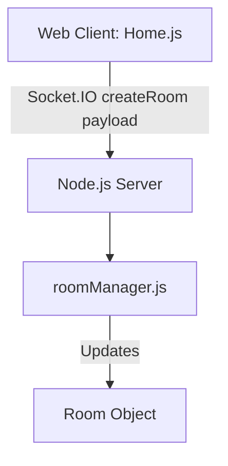

# System Design & Architecture

## Architecture Overview
**What is the high-level system structure?**
There are no major architectural changes. The flow for creating a room will be updated to pass an additional parameter (`durationMinutes`).

## Data Models
**What data do we need to manage?**
- `Room` Object (in `server/roomManager.js`):
  - `timeControl`: `{ initial: Number, increment: Number }`. `initial` will be set to `durationMinutes * 60`. `increment` will remain `0`.
  - `whiteTimeLeft`: Set to `durationMinutes * 60`.
  - `blackTimeLeft`: Set to `durationMinutes * 60`.

## API Design
**How do components communicate?**
- **Socket Event (Client -> Server):**
  - Event: `createRoom`
  - Payload: `{ durationMinutes: Number }` (Number can be 3, 5, 10, 15, or 30).
- **Socket Event (Server -> Client):**
  - Event: `roomCreated`
  - Returns `roomId` and `sessionToken` (unchanged).

## Component Breakdown
**What are the major building blocks?**

1. **Frontend: `Home.js` (or `CreateRoom` component)**
   - Add a UI selector (radio buttons or a dropdown) for the user to select the time control before clicking "Create Room".
   - Pass the selected `durationMinutes` in the socket `createRoom` call.

2. **Backend: `server.js`**
   - Update `socket.on('createRoom')` to read `durationMinutes` from the payload (or default to 15 if missing for backward compatibility) and pass it to `roomManager.createRoom(durationMinutes)`.

3. **Backend: `roomManager.js`**
   - Update `createRoom(durationMinutes)` signature.
   - Use `durationMinutes * 60` for `timeControl.initial`, `whiteTimeLeft`, and `blackTimeLeft`.

## Design Decisions
**Why did we choose this approach?**
- **Backward Compatibility**: If a client without the update sends a `createRoom` event with no payload, it will default to 15 minutes, avoiding any crashes.
- **Simplicity**: No increment simplifies the clock logic on both client and server.
- **AI Compatibility**: `aiClient.js` already calculates the `time_control` string based on `room.timeControl.initial`, so it will automatically format `5+0` or `10+0` without any changes.

## Non-Functional Requirements
**How should the system perform?**
- **Security**: The server must validate that `durationMinutes` is a number and is within the allowed presets (3, 5, 10, 15, 30) to prevent abuse (e.g., someone sending a 9999-minute game or negative numbers).
