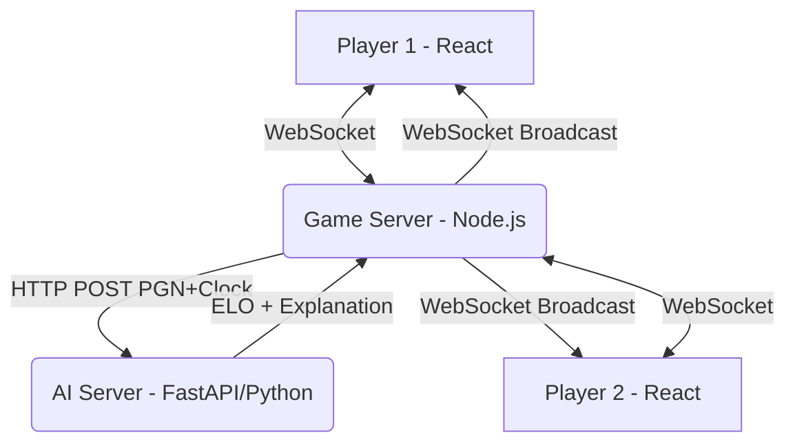

# BÁO CÁO TUẦN 12 — DỰ ĐOÁN ELO CỜ VUA TỪ LỊCH SỬ VÁN ĐẤU

## MỤC LỤC

---

## CHƯƠNG I. TỔNG QUAN DỰ ÁN VÀ TỔ CHỨC NHÓM

### 1.1. Đặt vấn đề và Mục tiêu nghiên cứu
*(Giữ nguyên từ tuần 8 — chỉnh sửa nhẹ ngôn ngữ cho phù hợp báo cáo cuối kỳ)*

### 1.2. Tổ chức nhóm và Phân công công việc
*(Giữ nguyên từ tuần 8 — cập nhật bảng phân công nếu có thay đổi)*

| Thành viên | Vai trò | Phụ trách chính |
|---|---|---|
| [Anh - Leader] | AI/ML Engineer | Data Pipeline, Model Training (CNN-BiLSTM), AI API Server |
| [Bạn Web] | Web Developer | Game Server (Whess), Frontend React, WebSocket |
| [Bạn LLM] | AI Engineer | Explainable AI, LLM Integration, Giải thích kết quả |

### 1.3. Tổng kết tiến độ từ Tuần 8 đến Tuần 12
Phần mới — Tóm tắt toàn bộ bước nhảy vọt so với tuần 8.

**Tuần 8 (Baseline):**
- Hoàn thành EDA, Feature Engineering, XGBoost Regression V3 → MAE 247.8.
- Đề xuất hướng Deep Learning CNN-BiLSTM (V4) như "Future Work".
- Thiết kế kiến trúc PoC Web nhưng chưa triển khai.

**Tuần 12 (Hiện tại):**
- ✅ **AI/ML (Chương 2):** Đã train thành công mô hình CNN-BiLSTM cải tiến (thêm CPL + Blunder), đạt **MAE 198.9** — vượt mục tiêu ≤220 và đánh bại XGBoost baseline 49 điểm.
- ✅ **Web Game (Chương 3):** Đã triển khai hoàn chỉnh hệ thống Game Server real-time (WebSocket), cho phép 2 người chơi cờ trực tuyến, thu thập PGN + Clock tự động.
- ✅ **Explainable AI (Chương 4):** Đã tích hợp LLM để sinh lời giải thích bằng ngôn ngữ tự nhiên cho kết quả dự đoán ELO.
- 🔧 **Tích hợp hệ thống (Integration):** Đã thiết kế xong API Contract giữa Web ↔ AI, sẵn sàng nối endpoint.

> Bảng so sánh mốc quan trọng:

| Hạng mục | Tuần 8 | Tuần 12 | Thay đổi |
|---|---|---|---|
| Model tốt nhất | XGBoost V3 | CNN-BiLSTM + CPL | Chuyển paradigm |
| Val MAE | 247.8 | **198.9** | ↓ 48.9 điểm |
| Web Game | Chưa có | Hoàn chỉnh (Whess) | Mới 100% |
| Explainable AI | Chưa có | LLM Integration | Mới 100% |
| Kiến trúc hệ thống | Bản thiết kế | Đã triển khai PoC | Prototype → Working |

---

## CHƯƠNG II. MÔ HÌNH DỰ ĐOÁN ELO — DATA PIPELINE & DEEP LEARNING
*(Phần của Leader / AI Team — viết chi tiết)*

### 2.1. Tổng quan hướng tiếp cận
- Bài toán: Dự đoán ELO (số liên tục) từ lịch sử ván đấu.
- Paper tham khảo: arXiv:2409.11506 — CNN-LSTM thuần túy (chỉ dùng Board + Clock).
- **Điểm cải tiến của nhóm:** Tiêm (inject) thêm tri thức từ Stockfish Engine (CPL, Blunder) vào kiến trúc gốc → giảm nhu cầu dữ liệu, tăng tốc hội tụ.

### 2.2. Xây dựng Bộ dữ liệu 600k ván cờ (Data Pipeline)
- Nguồn dữ liệu: Lichess Open Database.
- Quy trình xử lý: PGN → Parquet (lưu trữ tối ưu).
- Trích xuất CPL bằng Stockfish (Depth 8) cho từng nước đi → lưu dưới dạng JSON Array trong cột `cpl_seq`.
- Thống kê dữ liệu: Phân bố ELO, tỷ lệ time control, tỷ lệ có Clock/CPL.

### 2.3. Kiến trúc Mô hình CNN + Bi-LSTM (761,218 tham số)

#### 2.3.1. Tầng CNN — Trích xuất đặc trưng không gian bàn cờ
- Input: Ma trận Bitboard `[12, 8, 8]` cho mỗi nước đi.
- 4 lớp Conv2D (32 filters) + BatchNorm + ReLU.
- Output: Vector embedding 256 chiều cho mỗi vị trí bàn cờ.

#### 2.3.2. Tầng Bi-LSTM — Nắm bắt diễn biến ván cờ theo thời gian
- Input: Nối [CNN_embedding(256), Clock(1), CPL(1), Blunder(1)] = 259 chiều.
- 3 lớp Bi-LSTM (hidden_size=64).
- Output: Vector 128 chiều (64×2 chiều từ 2 hướng).

#### 2.3.3. Tầng Fully Connected — Dự đoán ELO
- FC: 128 → 32 → 2 (White ELO, Black ELO).
- Loss Function: L1 Loss (MAE).

#### 2.3.4. Sơ đồ kiến trúc (Mermaid)
```
PGN → [Replay Board] → CNN(12,8,8) → Embedding(256)
                                            ↓
Clock → Normalize ──────────────────→ Concat → [256 + 1 + 1 + 1 = 259]
CPL → Clamp & Normalize ───────────→           ↓
Blunder → Binary Flag ─────────────→     Bi-LSTM (3 layers)
                                            ↓
                                     FC → [White_ELO, Black_ELO]
```

### 2.4. Quá trình Training trên Kaggle

#### 2.4.1. Cấu hình môi trường
- GPU: Tesla T4 (Kaggle Free Tier, max 12h/session).
- Batch size: 32, Learning rate: 1e-4, Optimizer: Adam.
- Scheduler: ReduceLROnPlateau (patience=5).

#### 2.4.2. Sự cố Gradient Exploding (Loss = NaN)
- **Nguyên nhân:** Dữ liệu CPL từ Stockfish chứa giá trị `float("nan")` tại các nước chiếu hết → lan truyền qua toàn bộ LSTM → mọi weight bị nhiễm NaN vĩnh viễn.
- **Giải pháp:**
  - Hàm `_safe_parse_json()`: Replace `NaN`/`Infinity` thành `null` trước khi parse JSON.
  - Hàm `_is_valid_number()`: Kiểm tra giá trị hợp lệ (loại bỏ None, NaN, Inf).
  - Kỹ thuật Clamp: `max(0, min(cpl, 2000))` — cắt ngọn CPL cực đoan.

#### 2.4.3. Kết quả Training (22 Epochs / 11.5 tiếng)

| Epoch | Train MAE | Val MAE | Ghi chú |
|---|---|---|---|
| 1 | 317.8 | 313.3 | Bắt đầu |
| 2 | 277.1 | 246.2 | Đánh bại XGBoost (247.8) |
| 6 | 241.4 | 217.4 | Đạt target ≤220 |
| 14 | 218.8 | 202.7 | Sub-210 |
| 19 | 210.8 | **198.9** | **Best — Sub-200** |
| 22 | 209.0 | 202.5 | Session timeout |

### 2.5. Phân tích và Đánh giá kết quả

#### 2.5.1. So sánh tổng hợp các phương pháp

| Phương pháp | Features | Dữ liệu | Val MAE |
|---|---|---|---|
| XGBoost V3 (Baseline) | 11 features thủ công | 600k ván | 247.8 |
| CNN-BiLSTM (Paper gốc) | Board + Clock | 1.2M ván | ~182.0 |
| **CNN-BiLSTM + CPL (Ours)** | **Board + Clock + CPL + Blunder** | **432k ván** | **198.9** |

#### 2.5.2. Nhận định
- Mô hình Deep Learning vượt trội hoàn toàn so với XGBoost chỉ sau 2 epoch → chứng minh việc giữ nguyên tính tuần tự (sequence) của ván cờ quan trọng hơn nhiều so với tính toán aggregate features.
- Việc tiêm CPL/Blunder từ Stockfish cho phép đạt MAE sub-200 chỉ với 1/3 lượng dữ liệu so với paper gốc → Domain Knowledge + Deep Learning = sức mạnh cộng hưởng.
- Model chỉ có 761k tham số (rất nhỏ gọn), phù hợp triển khai trên hệ thống tài nguyên giới hạn.

---

## CHƯƠNG III. HỆ THỐNG WEB GAME CỜ VUA TRỰC TUYẾN (WHESS)

Hệ thống Whess (Web Chess) được xây dựng với mục tiêu cung cấp một nền tảng chơi cờ vua trực tuyến thời gian thực, đồng thời làm môi trường thu thập dữ liệu (PGN và thời gian suy nghĩ) để phục vụ cho mô hình dự đoán ELO.

### 3.1. Kiến trúc hệ thống Web
Hệ thống sử dụng mô hình Client-Server hiện đại, chia thành hai phần độc lập:
- **Client (Frontend):** Xây dựng bằng React.js (phiên bản 18), kết hợp thư viện giao diện Material-UI (MUI) để đảm bảo trải nghiệm người dùng (UX) mượt mà và giao diện (UI) chuyên nghiệp. Việc quản lý state và tương tác thời gian thực được xử lý qua `socket.io-client`.
- **Server (Backend):** Sử dụng Node.js kết hợp framework Express.js. Giao tiếp thời gian thực được đảm nhận bởi Socket.IO (v4). Server đóng vai trò trung tâm đồng bộ hóa trạng thái ván cờ giữa hai người chơi, quản lý đồng hồ và giao tiếp với AI Server.

**Sơ đồ luồng dữ liệu:**


### 3.2. Frontend — Giao diện và Tương tác người chơi
Phần Frontend được tối ưu để đảm bảo độ trễ thấp nhất trong quá trình thao tác:
- **Bàn cờ tương tác:** Sử dụng thư viện `react-chessboard` kết hợp cùng `chess.js` ở client-side để render bàn cờ, xử lý các thao tác kéo thả (drag-and-drop) và pre-validate nước đi (ví dụ: cấm đi sai luật cơ bản) trước khi gửi lên server.
- **Quản lý trạng thái:** Component `GameRoom` theo dõi toàn bộ state của ván đấu bao gồm thời gian còn lại của hai bên, lịch sử nước đi, và trạng thái phòng chờ. Đồng hồ đếm ngược được đồng bộ với server để đảm bảo tính công bằng.
- **Modal kết quả (Result Dialog):** Ngay khi ván cờ kết thúc (Chiếu bí, hết giờ, hòa), hệ thống hiển thị màn hình chờ (Loading) trong lúc Game Server gọi AI API. Sau đó, `CustomDialog` được render để hiển thị trực quan ELO dự đoán, CPL, số lượng Blunders và lời nhận xét bằng ngôn ngữ tự nhiên từ LLM.

### 3.3. Backend — Game Server
Game Server đóng vai trò "nguồn sự thật" (Source of Truth) cho mọi ván đấu. Kiến trúc mã nguồn được module hóa rõ ràng:
- **Room Manager (`roomManager.js`):** Xây dựng logic quản lý vòng đời phòng chơi. Mỗi phòng được cấp một mã UUID. Hỗ trợ người chơi tạo phòng, chia sẻ link mời, ghép cặp (Join Room) và xử lý sự kiện ngắt kết nối (Disconnect/Reconnect) để khôi phục trạng thái.
- **Game Logic (`gameLogic.js`):** Sử dụng `chess.js` trên server để validate nước đi một cách tuyệt đối (Server-side validation), phòng chống gian lận từ client. Đánh giá trạng thái Checkmate, Draw, Stalemate.
- **Clock Manager (`clockManager.js`):** Quản lý thời gian thực với độ chính xác mili-giây. Xử lý logic chuyển lượt (turn switch), trừ giờ của người chơi đang đi, và tự động xử thua khi cạn thời gian (Timeout).

### 3.4. Tích hợp AI — Gọi API dự đoán ELO (Giai đoạn chuẩn bị)
Sự khác biệt cốt lõi của Whess so với các web cờ vua thông thường là tích hợp AI dự đoán ELO. Hiện tại, team Web đã hoàn thiện phía Client-Server để sẵn sàng kết nối:
- **Thu thập dữ liệu:** Trong suốt ván đấu, Server ghi nhận chính xác thời gian suy nghĩ (clock) cho từng nước đi. Khi game over, `chess.js` sẽ trích xuất PGN hoàn chỉnh.
- **Giao tiếp API (`aiClient.js`):** Server đóng gói PGN và mảng Clock Times thành payload JSON, gửi POST request tới AI Server thông qua HTTP REST (theo đúng API Contract).
- **Xử lý ngoại lệ (Fault Tolerance):** Do AI Server đang trong quá trình phát triển, hệ thống Web đã cài đặt cơ chế xử lý lỗi và timeout (nếu AI Server không phản hồi sau 30s). Web sẽ không bị crash mà vẫn đảm bảo luồng chơi game bình thường, thông báo cho người chơi rằng tính năng dự đoán AI đang tạm gián đoạn.

### 3.5. Demo & Kết quả đạt được
- Hệ thống Game Server hoạt động ổn định, độ trễ WebSocket thấp (< 1s), đáp ứng tốt việc chơi cờ thời gian thực.
- Đã hoàn thiện toàn bộ luồng logic Frontend - Backend, sẵn sàng ghép nối (Mock Integration) với AI Server. Cơ chế bất đồng bộ (`async/await`) đảm bảo việc gọi AI không gây nghẽn luồng xử lý chính của Node.js.
*(Ảnh minh họa: Giao diện bàn cờ, Modal báo lỗi kết nối AI (hoặc hiển thị ELO dự đoán khi dùng dữ liệu Mock) sẽ được đính kèm vào bản in)*

---

## CHƯƠNG IV. EXPLAINABLE AI — GIẢI THÍCH KẾT QUẢ BẰNG LLM
*(Phần của [Bạn LLM] — gợi ý outline để bạn ấy tự viết)*

### 4.1. Vấn đề: Tại sao cần giải thích kết quả?
- Model CNN-BiLSTM trả về một con số ELO khô khan.
- Người dùng cần hiểu: "Tại sao tôi được đánh giá ở mức này?"
- Nhu cầu về Explainable AI (XAI) trong ứng dụng thực tế.

### 4.2. Kiến trúc LLM Integration
- Input: Kết quả phân tích (ELO dự đoán, CPL trung bình, số Blunders, khai cuộc ECO).
- LLM Engine: [Ghi rõ dùng model gì — Gemini / GPT / Claude / Local LLM].
- Prompt Engineering: Thiết kế prompt để LLM sinh lời nhận xét phong cách huấn luyện viên cờ vua.
- Output: Đoạn văn bản tự nhiên giải thích điểm mạnh, điểm yếu của người chơi.

### 4.3. Ví dụ kết quả
- *(Bạn LLM tự bổ sung ví dụ input/output thực tế)*

### 4.4. Đánh giá chất lượng giải thích
- *(Bạn LLM tự bổ sung — có thể đánh giá bằng Human Evaluation hoặc so sánh với nhận xét của HLV thật)*

---

## CHƯƠNG V. NHỮNG THÁCH THỨC VÀ BÀI HỌC KINH NGHIỆM

### 5.1. Thách thức kỹ thuật

#### 5.1.1. Dữ liệu bẩn (Data Quality)
- CPL từ Stockfish chứa NaN → gây Gradient Exploding khi training Deep Learning.
- Bài học: Luôn validate và sanitize dữ liệu đầu vào trước khi đưa vào model.

#### 5.1.2. Tài nguyên tính toán hạn chế
- Kaggle Free Tier: Tối đa 12h/session, 30h GPU/tuần.
- Phải tối ưu Epoch count (15-20 thay vì 60), chấp nhận early stopping tự nhiên.
- Bottleneck CPU: Replay PGN → Board Tensor chiếm 70% thời gian training.

#### 5.1.3. Khác biệt hệ điều hành (Cross-platform)
- Script Web dùng cú pháp Linux (`PORT=3001 react-scripts start`) → lỗi trên Windows.
- Giải pháp: Dùng file `.env` hoặc thư viện `cross-env`.

#### 5.1.4. Tích hợp đa hệ thống (Integration)
- 3 thành phần (Web, AI, LLM) phát triển song song bởi 3 người khác nhau.
- Cần API Contract rõ ràng (JSON schema, cổng, format) để tránh xung đột.

### 5.2. Bài học rút ra
- **Feature Engineering + Deep Learning = Sức mạnh cộng hưởng:** Không nên cực đoan chọn 1 trong 2. Việc kết hợp Domain Knowledge (Stockfish CPL) với Neural Network cho kết quả vượt trội.
- **Kiến trúc Microservice (Decouple):** Tách AI ra khỏi Web giúp 2 team phát triển độc lập, không chặn nhau.
- **Tầm quan trọng của Baseline:** XGBoost V3 (MAE 247.8) đóng vai trò điểm chuẩn để đo lường mọi cải tiến sau đó.

### 5.3. Hướng phát triển tiếp theo (Future Work)
- Train thêm epoch trên Colab Pro với 1M+ ván cờ → tiệm cận MAE ~182 của paper.
- Ablation Study: Tắt CPL/Blunder để đo chính xác đóng góp của từng feature.
- Deploy hệ thống lên Cloud (Render/Railway) để demo online.
- Mở rộng: Hỗ trợ nhiều thể loại cờ (Bullet, Blitz, Rapid, Classical).
